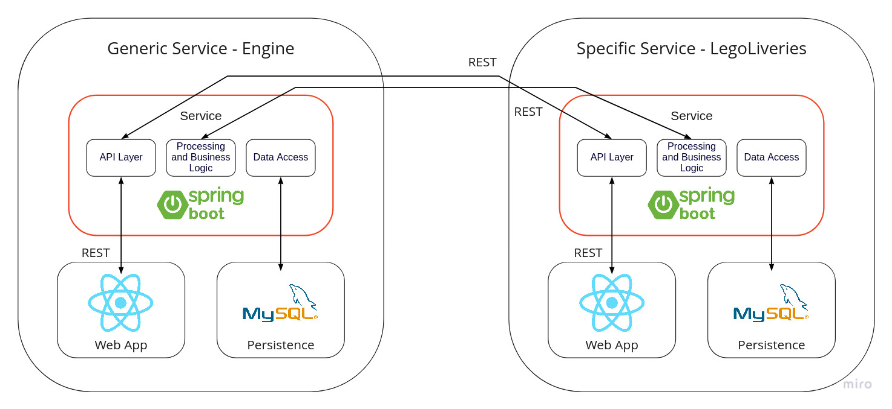
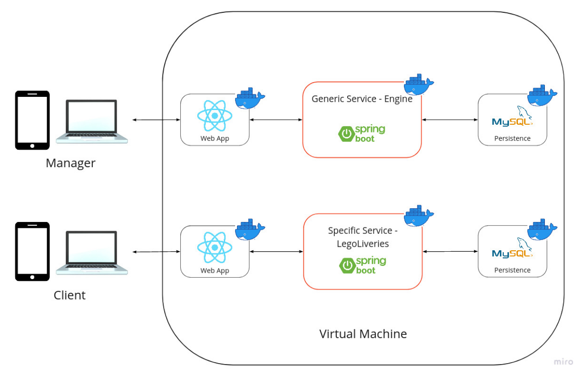
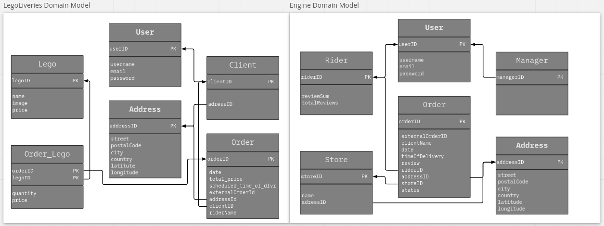

<h1 align="center">
TQS Delivery
</h1>
Project for Quality Assurance

There is more and more demand for delivery services. The idea of the TQS Delivery is to create a general service, Engine, where riders and stores can be added as to provide a new and better implementation of the old services. 

As to demonstrate the Engine, we created a specific delivery system, LegoLiveries, that can place an order on Lego sets.

This project aims to create a viable software product and a Software Quality Environment (SQE).

**Built with:**
- Spring Boot
- React
- Docker

## Team Members
- Filipe Gonçalves, 98083
- Gonçalo Machado, 98359
- Catarina Oliveira, 98292

## Roles
| Filipe | Gonçalo | Catarina |
| ------------- | ------------- | ------------- |
| Team Manager | DevOps | QA Engineer |
| Product Owner |  |  |

## Architecture
<p align="center">
  
</p>

## Deployment Diagram
<p align="center">
  
</p>

## Domain Models
<p align="center">
  
</p>

## How to Run
Each service and frontend is deployed in a docker, so having _docker_ and _docker-compose_ installed is required.

In the folder of the project:

1. Build the dockers
   
    ```
    $ docker-compose build
    ```
    
2. Start the containers:
    
    ```
    $ docker-compose up
    ```
    

The **Client Web application** will be available at: [localhost:3000](http://localhost:3000)

The **Rider and Manager Web application** will be available at: [localhost:3001](http://localhost:3001)


## Deployment
The project was deployed in the Virtual Machine given to us.

As such, to connect to each services:

- <a href="172.20.202.3:3000">LegoLiveries</a>
- <a href="172.20.200.3:3001">Dashboard</a>

**Client Credentials**
Email | Password |
--- | --- |
userA@gamil.com | userApass |
userB@gamil.com | userBpass |
userC@gamil.com | userCpass |

**Manager Credentials**
Email | Password |
--- | --- |
user1@gamil.com | user1pass |
user2@gamil.com | user2pass |
user3@gamil.com | user3pass |

## Other tools
Other tools used during the execution of the project.

- <a href="https://legoliveries.atlassian.net/jira/software/projects/LEGO/boards/1/roadmap">Backlog using Jira Software</a>
- [QA Manual](./deliverables/qa_manual.pdf)
- [Specification Report](./deliverables/report.pdf)
- [Presentation Slides](./deliverables/presentation.pdf)
